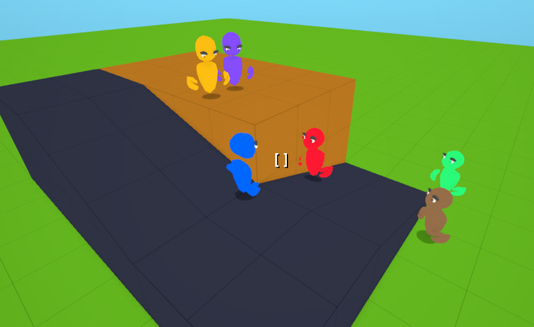
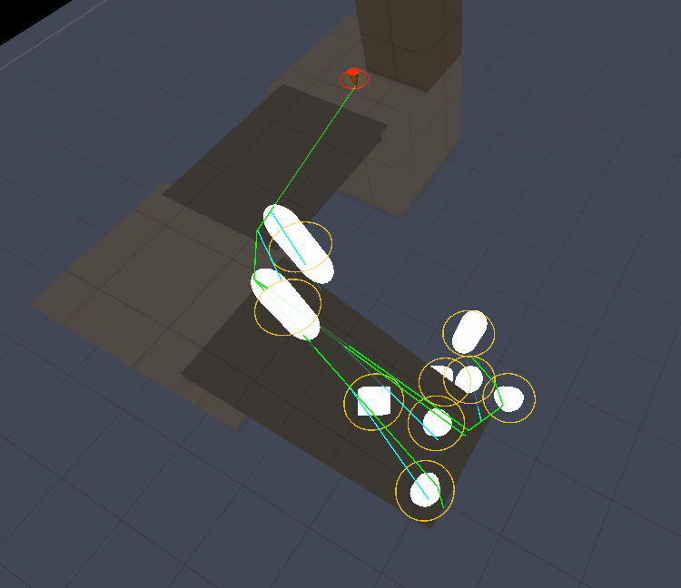
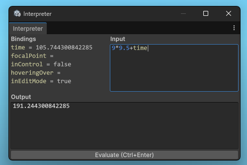
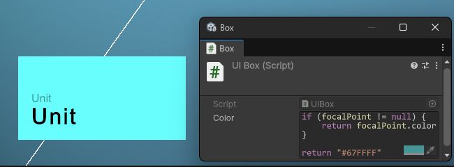

# Trees

Pieces of a colony simulation game, but not the game itself.

### Setup

- Unity 6000.6.0a2

### Scenes

- Main: testing various different things here, good place to check out
- Pathfinding: for verifying pathfinding
- UI: verifying ui toolkit
- Snowglobe: made it for testing goap, but didnt feel like writing new sets of goals/actions/facts
- Test Scene: barebones, used for cleaning up prefabs and its basically a dummy room

# The Main Scene

- 5 units
- Can fly the main camera around
- Can control and spectate units
- Can dispatch commands for all units:
  - G: Move here
  - F: Look at camera with eyes only
  - V: Look at camera
  - L: Look at point
  - J: Jump

There is a cinemachine camera setup here to switch between spectator camera, and first person
camera. A few interpreted script components are here to control this. UIToolkit stuff is
present here too. 

### Pathfinding

| In `Assets/Scripts/Pathfinding.cs`

The built in navigation system is used for this, but the paths are followed
using physics. Hence the generous dense matter in that file. 

Agents need to be registered, and unregistered with this class. Once
registered, `TryResolve()` can be called and that will retrieve the 
Vector2 move instruction.

### Scripting

| In `Packages/com.trees.scripting`.

There is a scripting language, and its interpreted usually
for UI or other small things. Places where a new C# component 
would be created.

There are `Value` types in it, and they can be serialized/deserialized
to source code and back. Built in types are handled, and for custom ones
thats extended through `ITypeHandler`, and registered with `ScriptingLibrary`.

### UI

| In `Assets/Scripts/UI`

Wanted to make use of UIToolkit and push its use, so I rewired it to
be rendered manually. This way I can edit UI with it through game objects
in the scene. It's essentially like the built in canvas UI, but it can be
authored in code, and with game objects. And scripting is integrated.

It is kinda messy, I blame Unity and its also exploratory code.

### GOAP

| In `Assets/Scripts/GOAP/`.

This version of GOAP has layers supported. So that a unit can look at X
while moving towards Y. Submitted goals can also decompose themselves
into smaller ones. So you can ask an actor to do something complicated
and it can divide it down into smaller instructions. This is how "Appear in front of me"
can eventually become a series of move and look instructions.

### Pawn

| Prefab + component combo

These prefabs have pitch and yaw angles for the head and body exposed, as well
as the eyes. And a pawn on its own doesn't do anything, as it's just visuals. 

### Unit

| Prefab + component combo

This is what combines the navmesh agent, GOAP actor, with the pawn visuals
all in one big fury. Ideally it stays as small as possible, as its not 
simply just glue, it also represents the actual unit in a game.

The `SubmitGoal()` is what should be used, then `Act()` is called in FixedUpdate
to progress the actors internal state.

### What for?

I don't exactly care what the end result is, because it started out as a curiosity
of how I could organize a colony sim game. Which turned into a curiosity for how
far could I take project, if I'm not allowed defensive programming. Because as
valuable as those techniques can be, I've always made use of them, sometimes to
a sickening degree. As for what is/isn't defensive programming, interpret as you wish.

And there is still some of that defensive programming, so its a continuous process for me.